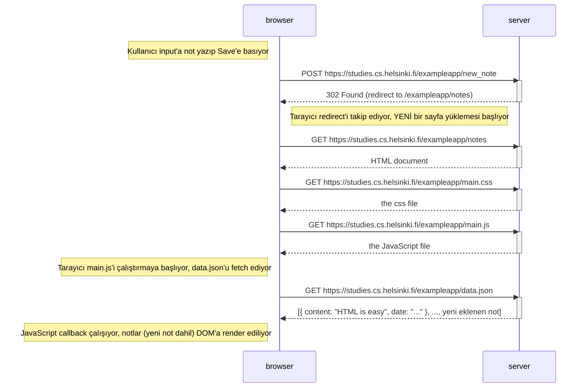

```mermaid
sequenceDiagram
participant browser
participant server

Note left of browser: Kullanıcı input'a not yazıp Save'e basıyor

browser->>server: POST https://studies.cs.helsinki.fi/exampleapp/new_note
activate server
server-->>browser: 302 Found (redirect to /exampleapp/notes)
deactivate server

Note right of browser: Tarayıcı redirect'i takip ediyor, YENİ bir sayfa yüklemesi başlıyor

browser->>server: GET https://studies.cs.helsinki.fi/exampleapp/notes
activate server
server-->>browser: HTML document
deactivate server

browser->>server: GET https://studies.cs.helsinki.fi/exampleapp/main.css
activate server
server-->>browser: the css file
deactivate server

browser->>server: GET https://studies.cs.helsinki.fi/exampleapp/main.js
activate server
server-->>browser: the JavaScript file
deactivate server

Note left of browser: Tarayıcı main.js'i çalıştırmaya başlıyor, data.json'u fetch ediyor

browser->>server: GET https://studies.cs.helsinki.fi/exampleapp/data.json
activate server
server-->>browser: [{ content: "HTML is easy", date: "..." }, ..., yeni eklenen not]
deactivate server

Note left of browser: JavaScript callback çalışıyor, notlar (yeni not dahil) DOM'a render ediliyor
```
