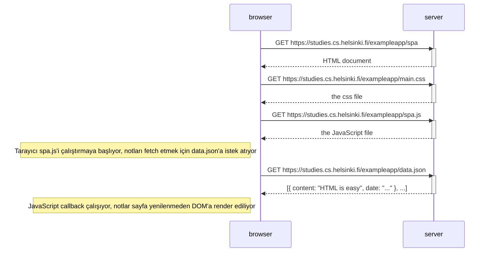

```mermaid
sequenceDiagram
participant browser
participant server

browser->>server: GET https://studies.cs.helsinki.fi/exampleapp/spa
activate server
server-->>browser: HTML document
deactivate server

browser->>server: GET https://studies.cs.helsinki.fi/exampleapp/main.css
activate server
server-->>browser: the css file
deactivate server

browser->>server: GET https://studies.cs.helsinki.fi/exampleapp/spa.js
activate server
server-->>browser: the JavaScript file
deactivate server

Note left of browser: Tarayıcı spa.js'i çalıştırmaya başlıyor, notları fetch etmek için data.json'a istek atıyor

browser->>server: GET https://studies.cs.helsinki.fi/exampleapp/data.json
activate server
server-->>browser: [{ content: "HTML is easy", date: "..." }, ...]
deactivate server

Note left of browser: JavaScript callback çalışıyor, notlar sayfa yenilenmeden DOM'a render ediliyor
```
